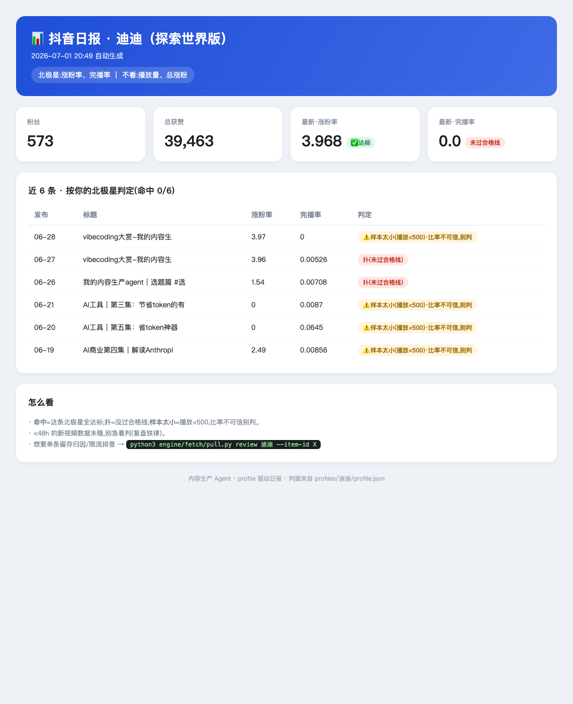
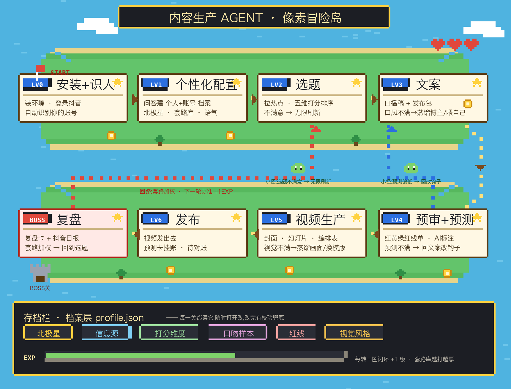

<!-- lang -->**[中文](README.md) | English**

# NorthStar Studio · a personal content agent for short-form creators

> An AI agent that runs your whole short-video workflow inside [Claude Code](https://claude.com/claude-code): **pick topic → write script → pre-publish check → produce → review the numbers**, then loops what worked back into the next round.
>
> The idea: **shared brain, one profile per creator.** You answer a few questions once to build *your* profile (your North Star metric, audience, voice, no-go rules, visual style). After that every step runs off *your* profile — not some influencer's playbook copy-pasted onto you.

> **TikTok creators, read this first:** the agent's "brain" (topic scoring, scripting, compliance check, number-judging, daily dashboard) is platform-agnostic and works great for TikTok — you just paste your **TikTok Analytics** numbers in. The *fully automatic* data pull (log into your browser, it reads your entire creator backend with zero setup) currently only works on **Douyin** (China's TikTok), because it talks to Douyin's creator API. A TikTok auto-adapter is on the roadmap. So today: **Douyin = fully automatic, TikTok = manual numbers + full brain.** Everything else is identical.

## What it actually does for you

| Stage | What you get |
|---|---|
| **Onboarding** | A conversation (not a form) that builds your profile + figures out the *one metric your account should actually chase* |
| **Topics** | Pulls what's trending in your niche, scores 8–10 topic ideas on 5 dimensions, ranks them. Don't like the list? Re-roll infinitely |
| **Script** | A full voiceover script + a publish kit (titles / hashtags / cover / a prediction of how it'll do). Tone feels off? Point it at a creator whose style you want, or feed it your own old scripts |
| **Pre-publish check** | A red / yellow / green risk list *before* you post: reach-suppression triggers, missing AI-content disclosure, claims that break platform rules — each with the smallest fix that keeps your voice |
| **Produce** | Cover + on-screen slides + a shot list in your visual style (swappable template library) |
| **Review** | After posting, it judges each video **hit / miss by *your* North Star** — not by vanity views. Tells you *why* (hook problem vs. pacing problem), flags shadowban risk, and gives you a daily dashboard |
| **Loop** | What worked gets weighted into your personal playbook, so next week's topics get sharper |

For **Douyin**: just stay logged in in your browser and the agent reads your full backend automatically (watch-through rate, follows, retention curve, traffic sources) — no cookie copy-pasting. For **TikTok**: paste the numbers from your TikTok Analytics and the same engine does the rest.



> The profile-driven daily dashboard — KPI cards for **your** North Star, every recent video judged hit/miss by your profile. (Shown here for a Douyin account; TikTok users get the same dashboard from pasted Analytics.)

## What's a "North Star metric"?

**Your North Star = the 1–2 numbers your account should chase, and nothing else.** It's set by *your* business goal. Every step (topic scoring, prediction, review) aims at it, and vanity numbers like raw views get ignored on purpose — so you stop optimizing the wrong thing.

| Your goal | North Star | In plain English |
|---|---|---|
| Grow the account | **Follow rate** (new follows ÷ 1K views) | Of every 1,000 people who saw it, how many followed — are you attracting the *right* people |
| Sell (TikTok Shop / affiliate) | **Revenue per video** | What this video actually sold. High views with no sales = nothing |
| Build an owned audience | **Link clicks / DMs / email signups** | People leaving the app to your link-in-bio, Discord, or newsletter — the audience the algorithm can't take away |
| Teach / go-to value account | **Save rate** (saves ÷ likes) | A high save rate means people think "useful, I'll keep this" — a precision signal |
| Everyone's floor | **Completion / avg watch time** | Clear the floor first; if people don't watch through, nothing else matters |

You pick yours in onboarding. On Douyin the agent even pulls your last 30 posts and checks your *stated* goal against your *actual* data — when they disagree, it shows you both and you decide (the data usually wins). On TikTok you feed it a few Analytics numbers and it does the same check.

## What onboarding asks you

It's a conversation — **one question at a time**, each with hints and examples. **Stuck? That's fine** — the agent gives you options, rephrases, or suggests a sensible default. It never forces an answer or makes one up:

| It asks | Hint / if you're stuck | It sets |
|---|---|---|
| ① What kind of account, and what result do you want most? | grow / sell / build audience / brand deals / persona; stuck? "more followers, actual sales, or people DMing you?" | **North Star** + positioning + monetization |
| ② Who's it for? Anyone you *don't* want? | age + who they are + their pain; stuck? picture one typical viewer | Sources + topic weighting |
| ③ What do you have that most in your niche don't? (job / experience / scars) | "2 years as a makeup counter rep"; none yet → mark "to find later" | The "only you" scoring dimension |
| ④ Main platform? Where do you send people off-app? | TikTok / Douyin / IG; link in bio / Discord / email, or none for now | Compliance rules + funnel |
| ⑤ 3 creators you're jealous of? | who you want to become; can't name any → search together or add later | Auto-analyzed → seeds your playbook |
| ⑥ Paste 1–2 of your own posts you're proud of? | so scripts sound like you; new account? we'll calibrate later | Voice samples |
| ⑦ Visual style? On camera or not? | pick from template options, don't start from scratch | Cover / slide look |
| (last) What's the account called? | display + folder id only | Profile id |

Then it **locks in your North Star as a concrete number** (e.g. "follow rate >1 + completion ≥5%") and shows you a summary card to confirm before saving anything — no half-finished setups.

## Install

Needs: macOS + [Claude Code](https://claude.com/claude-code) + Python 3.10+. (For automatic Douyin pull: Chrome/Edge logged into Douyin. For TikTok: nothing extra — you'll paste numbers.)

```bash
git clone https://github.com/weid00360-bot/northstar-studio.git
cd northstar-studio
python3 -m venv .venv
.venv/bin/pip install -r engine/fetch/requirements.txt
```

Then open the folder in Claude Code and say **"help me build my profile"** to start onboarding.

## Quick check (does the engine run?)

```bash
cd engine && python3 validate_profile.py 迪迪     # validates a sample profile → "OK, engine can consume it"
```

There are two sample profiles to poke at: a Douyin AI-tools account and a career-advice account — feeding the same numbers to each gives *different* verdicts, which is the whole point (the engine hardcodes no one).

## User journey (8 levels, game-map style)



```
LV0 Install + detect account  →  LV1 Personalize (build profile)  →  LV2 Topics (♻️ re-roll freely)
→  LV3 Script (off-tone? clone a creator's style / feed your own)  →  LV4 Pre-check + Prediction (weak forecast? back to the hook)
→  LV5 Produce (visuals off? swap template)  →  LV6 Publish  →  BOSS: Review the numbers
→  Loop: fold what worked into your playbook → next round is sharper
```

## Why it's "universal", not another template pack

1. **The engine reads your profile and hardcodes no one.** Same numbers, different profiles → different topic scores, different verdicts, different sources. There's a regression test proving it.
2. **Mechanics vs. examples are separated.** The *mechanics* of what makes videos work (hook patterns, the scoring rubric, the 2-second-drop-off rule) are shared by everyone; the *examples* for your niche get analyzed from creators **you** pick — into **your** playbook.
3. **You can change anything.** North Star, sources, weights, voice, no-go rules all live in your `profile.json`, with a validator as a safety net.
4. **Data beats your gut.** Say you want followers, but your data says your real strength is saves? It surfaces the conflict and lets you decide.

## Honest limitations

- **Automatic backend pull is Douyin-only right now.** On TikTok you paste your Analytics numbers by hand; the brain works the same. A TikTok data adapter is planned.
- Compliance rules ship strongest for Douyin (from its official Creator Academy) + generic reach-suppression triggers that apply everywhere. TikTok-specific policy nuances are lighter — treat the check as a smart assistant, not a lawyer.
- Voice can't be 100% automatic — to sound like you, it needs a couple of your real past scripts.
- It runs in Claude Code (a coding-agent tool), so you're comfortable running a couple of terminal commands. If you can copy-paste, you're fine.

## Privacy

- Cookies (Douyin) are read and used only on your machine, uploaded nowhere.
- Your real profile lives in `profiles/your_id/` and is **git-ignored** by default — the repo only ships sample profiles. Your numbers never leave your laptop.

---

Built by a creator generalizing her own content engine, now iterating with a small hands-on group. **Clone it, try it, and please open an issue with feedback — that's what makes it better.** ⭐ appreciated.
